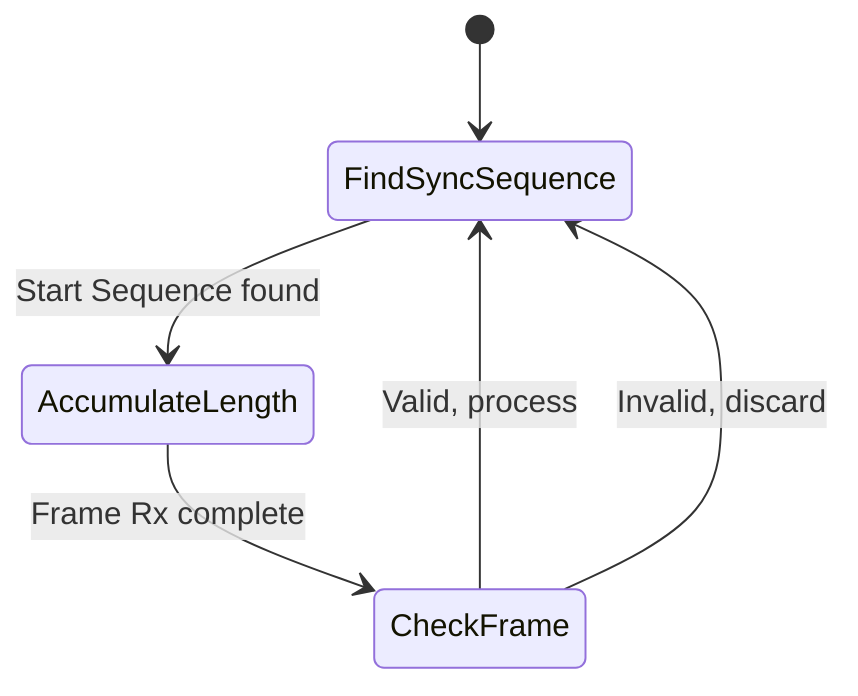

import Mermaid from '@theme/Mermaid';

# proton_core

**proton_core** is the central C implementation and code generation toolchain for Proton. It's designed for resource-constrained microcontrollers where memory and CPU are limited.

All other Proton-related libraries expand upon concepts and methods defined in proton_core.

## Main Features

- **Signal/Bundle Handling**: Initialization, encoding/decoding via nanopb
- **Signal Registry API**: Set and get Signal values, manage Bundles
- **Node Manager API**: Periodic updates, marking Bundles for transmission
- **Transport Framing Helper Functions**: Magic bytes, length encoding, CRC16 validation

## Signal Registry API (registry.h)

The Signal Registry API contains the type-specific setters and getters for Signals, as well as utilities for setting callbacks that fire when Bundles are successfully decoded. Users are expected to maintain the `proton_registry_t` context pointer is valid when calling these API's, otherwise a `PROTON_NULL_PTR_ERROR` will be returned.

### Setting/Getting

For scalar values, setting and getting is very straightforward. The API will do a search through the registry to find the Signal ID, then either set the value, or populate the supplied pointer.

```C
  proton_status_e proton_signal_get_double(
    const proton_registry_t * registry, uint32_t signal_id, double * value);
  proton_status_e proton_signal_set_double(
    const proton_registry_t * registry, uint32_t signal_id, double value);
```

For repeated types, the process is more complicated as the Signal's capacity must be taken into account:

```C
  proton_status_e proton_signal_get_string(
    const proton_registry_t * registry, uint32_t signal_id, char * buf, size_t capacity,
    size_t * out_len);
  proton_status_e proton_signal_set_string(
    const proton_registry_t * registry, uint32_t signal_id, const char * str, size_t len);

  proton_status_e proton_signal_get_bytes(
    const proton_registry_t * registry, uint32_t signal_id, uint8_t * buf, size_t capacity,
    size_t * out_len);
  proton_status_e proton_signal_set_bytes(
    const proton_registry_t * registry, uint32_t signal_id, const uint8_t * data, size_t len);
```

:::note
For strings, the `size_t len` value _includes_ the null char.
:::

### A Note on Memory Safety and Concurrency

The Signal Registry contains two function pointers to call when accessing the registry. The intention is for these callbacks to lock and unlock a user-supplied mutex. Because proton is designed to be a minimal implementation by default, and does not contain any knowledge of what OS, RTOS, or environment it is running on, these callbacks are no-ops by default. The Signal Registry API also supplies two functions to lock and unlock the registry at user discretion. When sharing the Registry between threads/tasks, it is imperative that the user ensures that locks and unlocks are used properly.

### Bundle Management

The primary user API for Bundle Management is mainly for getting a descriptor for a Bundle, setting a "Bundle successfully decoded" callback, and setting the Bundle's period, if that is something you're interested in doing at runtime.

:::note
Bundles require a buffer to be used as a scratchpad when encoding and decoding. `proton_registry_get_bundle_encode_decode_buffer` is an INTERNAL API that is used for encode/decode purposes and is not a user-level knob to turn.
:::

```C
  /**
   * Get the bundle from a registry by ID
   * slot_idx is optional output parameter for the index of the bundle in the registry
   * @return pointer to the bundle descriptor, or NULL if not found
   */
  const bundle_desc_t * proton_registry_get_bundle(
    const proton_registry_t * registry, uint32_t bundle_id, size_t * slot_idx);

  /**
   * Get the buffer for encoding/decoding signals from a bundle
   * @return pointer to the buffer, or NULL if not found
   */
  proton_Signal * proton_registry_get_bundle_encode_decode_buffer(
    const proton_registry_t * registry);

  /**
   * Get the callback for a bundle
   */
  proton_bundle_cb_t * proton_registry_get_bundle_callback(
    const proton_registry_t * registry, uint32_t bundle_id);

  /**
   * Set the callback for a successful bundle decode.
   * @note the registry mutex will be acquired when this callback fires, so it is safe to get/set registry values
   * at this time. However, it should also be noted that the registry will be updated with new values before
   * this callback is called.
   */
  void proton_registry_set_bundle_callback(
    proton_registry_t * registry, uint32_t bundle_id, proton_bundle_cb_f bundle_cb, void * context);

  /**
   * Set bundle period for a bundle in the registry
   */
  void proton_registry_set_bundle_period(
    proton_registry_t * registry, uint32_t bundle_id, uint32_t period_ms);
```

### Bundle Decode Callback

When data is sent to the Node Manager API and is successfully decoded, a user-supplied Bundle callback is fired. The callback contains the Bundle ID, and a list of Signal ID's that were updated. If Registry-locking mutexes are used, this callback is fired while the Registry is locked, so getting and setting values within the registry can be done without fear of race conditions.

```C
  /**
   * @typedef proton bundle callback, called when a bundle is successfully decoded
   * parameters are: bundle ID, array of signal ID's associated with bundle, void* for user context
   */
  typedef void (*proton_bundle_cb_f)(uint32_t, const uint32_t *, size_t, void *);

  typedef struct proton_bundle_cb
  {
    proton_bundle_cb_f cb;
    void * arg;
  } proton_bundle_cb_t;
```

## Node Manager API (node_manager.h)

The Node Manager API is the main user-level encode/decode and read/write interface to Proton.

### Reading and Writing

Data received from other peers is submitted to the Node Manager API for decoding and updating Signals.

Node Manager also needs to be periodically "spun" to determine which Bundles are necessary to send. This is done via `proton_node_update()`. If a Bundle is ready to be sent, `proton_node_update()` will also denote which Peer/Endpoint combo(s) it needs to be sent to. A Bundle may need to be sent to multiple Peers over different Endpoints, so the returned data is not framed for any specific transport mechanism.

```C
  /**
   * Receive a message for a node, decode it, and update the registry and bundle callbacks as necessary
   * The input buffer is expected to be a non-framed protobuf message, since framing is
   * transport-specific and the node manager is transport-agnostic. The user is expected to handle any framing
   * based on the transport API.
   *
   * This function will decode the message, update the signal registry with new information,
   * and call the relevant bundle callback if a bundle is successfully decoded.
   */
  proton_status_e proton_node_receive(proton_node_t * node, const uint8_t * buffer, size_t len);

  /**
   * Update function to be called periodically by the user to check if there are any messages to send
   * This function will encode bundles by a priority scheme:
   *   - "triggered" bundles (see proton_node_trigger_bundle) are prioritized over non-triggered bundles
   *   - "most overdue" bundles are prioritized over less overdue bundles
   *   - in the event of no overdue bundles, bundles with older last-send timestamps are prioritized over newer ones.
   * The priority order is essentially as follows:
   *   - "most overdue" triggered bundles
   *   - "most overdue" non-triggered bundles
   */
  proton_status_e proton_node_update(
    proton_node_t * node, uint64_t uptime_ms, uint8_t * buffer, size_t buffer_len, size_t * out_len,
    proton_endpoint_t * dest_peers, size_t num_dest_peers, size_t * num_selected_peers);
```

### Triggered Bundles

If a Bundle does not have a periodic value, or if the period is 0, it can only be marked for sending if it is "triggered". Triggered bundles take priority over other Bundles that are ready to send. The amount of bundles that can be triggered is settable via the build-time parameter `PROTON_MAX_PENDING_TRIGGERS`, with a default value of 4.

```C
  /**
   * Set a bundle ID to be sent at the next available node update, according to priority rules.
   */
  proton_status_e proton_node_trigger_bundle(proton_node_t * node, uint32_t bundle_id);
```

### Bundle Priority

Because `proton_node_update()` only selects one Bundle per call, Node Manager operates on the following priority scheme when calling `proton_node_update()`:

1. Triggered Bundles take priority. If there are multiple triggered Bundles, it works on a "first-triggered, first-sent" (FIFO) behaviour.
2. If there are no triggered Bundles to send, the "most overdue" periodic Bundle is selected. When a Bundle is selected, the Bundle context is updated with the time that `proton_node_update()` selected it. The greatest difference between the timestamp passed to `proton_node_update() and the last time a given Bundle was selected determines "Most Overdue"

## Transport Framing API (transport.h)

Proton provides helper functions for framing the data returned by the Node Manager for transmission over serial or UDP. Because there are different factors to consider when framing for packetized protocols vs streams, there are transport-specific framing API's.

### UDP4 (transport/udp4.h)

UDP4 operates over Ethernet, which provides built-in packetization and checksumming. Therefore, the transport header for UDP4 is less about data integrity and more about specifying which Peer a packet is for, if a Peer Node uses the same socket for multiple endpoints.

```C
  /**
   * @brief Populate header to the current version with session information
   */
  proton_status_e proton_udp4_fill_header(
    proton_udp4_header_t * header, uint8_t node_id, uint8_t flags);

  /**
   * @brief Check for the presence of a header in the proton payload
   * @note proton UDP4 version 1 does not have a header. If no header is parsable, say it's a version 1
   */
  proton_status_e proton_udp4_check_payload(
    const uint8_t * payload, const uint16_t payload_len, proton_udp4_header_t * out_header);
```

### Serial (transport/serial.h)

Serial transport is more involved, requiring stream synchronization and integrity checking. See [the transport framing](..#serial-transport) for more information on formatting.

The serial API contains methods to populate the 6-byte header, including the CRC. It also contains functions to validate and de-payload data received from peers.

Because serial streams are not packetized, the user is expected to implement buffering the data from the hardware transport, as well as maintaining the following state machine.



## Adding Proton to Your Project

Since proton_core exports itself as a cmake project, you can install it as a normal cmake dependency if it's built and installed via `-DPROTON_INSTALL=ON`

```CMake
project(your_project_name)
find_package(proton REQUIRED)
add_executable(your_project_name main.c)
target_link_libraries(your_project_name proton::proton_core)
```

If installation is not preferred, it is also possible to use `FetchContent` to fetch the repository from GitHub as part of your build process.

```CMake
include(FetchContent)
FetchContent_Declare(
  proton
  GIT_REPOSITORY https://github.com/clearpathrobotics/proton.git
  GIT_TAG 2.0.0
)

FetchContent_MakeAvailable(proton)
```

:::note
Set the GIT_TAG to a specific commit hash or tag for consistency, otherwise you will always pull in the latest changes.
:::

### Adding Proton to an Embedded Target

Embedded targets usually cannot link a pre-built libproton_core.a. Typically source files are added to a list of files to be built in the

If proton is installed as a typical cmake project, it can be included via `include()` and some exported cmake variables to just get the file lists.

```CMake
find_package(proton CONFIG REQUIRED)

include("${proton_DIR}/ProtonTargets.cmake")

# Proton's cmake install also exports the sources as cmake variables
set(PROTON_SRCS
  ${PROTON_CORE_SOURCES}
  ${PROTON_CPP_SOURCES}
)

add_executable(${PROJECT_NAME} ${YOUR_PROJECT_SRCS} ${PROTON_SRCS})
```

Headers can be included via cmake target properties

```CMake
set(PROTON_INCLUDE_DIRS "")
foreach(_tgt IN ITEMS proton::proton_core proton::proton_cpp)
  get_target_property(_inc ${_tgt} INTERFACE_INCLUDE_DIRECTORIES)
  if(_inc)
    list(APPEND PROTON_INCLUDE_DIRS ${_inc})
  endif()
endforeach()

list(REMOVE_DUPLICATES PROTON_INCLUDE_DIRS)

target_include_directories(${PROJECT_NAME} ${YOUR_INCLUDE_DIRECTORIES} ${PROTON_INCLUDE_DIRS})
```

Proton can of course also be vendored via git submodule and its sources/headers included directly into your project.

```CMake
set(PROTON_DIR "${CMAKE_CURRENT_LIST_DIR}/proton")
set(PROTON_CORE_DIR "${PROTON_DIR}/core")
set(NANOPB_DIR "${PROTON_DIR}/external/nanopb")

set(PROTON_SRCS
  "${PROTON_CORE_DIR}/src/common.c"
  "${PROTON_CORE_DIR}/src/encode_decode.c"
  "${PROTON_CORE_DIR}/src/node_manager.c"
  "${PROTON_CORE_DIR}/src/proton_field_callbacks.c"
  "${PROTON_CORE_DIR}/src/registry.c"
  "${PROTON_CORE_DIR}/src/transport/serial.c"
  "${PROTON_CORE_DIR}/src/transport/udp4.c"
  "${PROTON_CORE_DIR}/src/generated/signal.pb.c"
  "${PROTON_CORE_DIR}/src/generated/bundle.pb.c"
  "${PROTON_CORE_DIR}/src/generated/proton.pb.c"
  "${NANOPB_DIR}/pb_common.c"
  "${NANOPB_DIR}/pb_decode.c"
  "${NANOPB_DIR}/pb_encode.c"
)

set(PROTON_INCLUDE_DIRS
  "${PROTON_CORE_DIR}/include"
  "${NANOPB_DIR}"
)
```

### Adding the Generated Registry

If using proton_core's [registry generator](./registry_generator.mdx) you will also need to add the files to your project. These are not exported as a cmake project, add them as regular files.

```CMake
set(GENERATED_FOLDER ${CMAKE_CURRENT_BINARY_DIR}/generated)

set(GENERATED_REGISTRY_FILES
  "${GENERATED_FOLDER}/target_registry.c"
  "${GENERATED_FOLDER}/target_node.c"
  "${GENERATED_FOLDER}/target_registry_ids.h"
  "${GENERATED_FOLDER}/target_registry_sizes.h"
  "${GENERATED_FOLDER}/target_connections.h"
)

add_executable(${PROJECT_NAME} ${YOUR_PROJECT_SRCS} ${GENERATED_REGISTRY_FILES})
```
