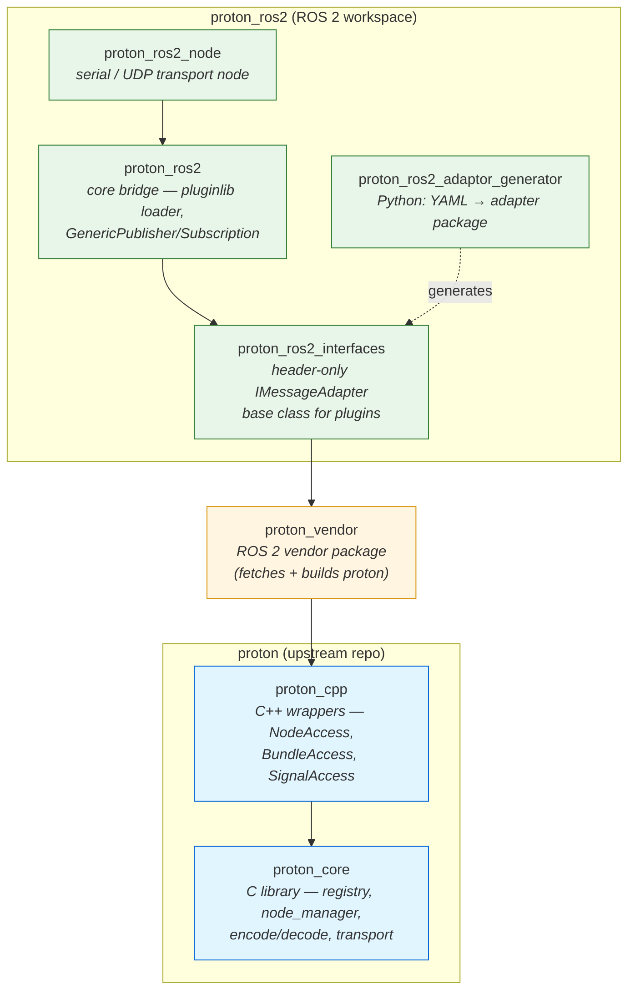

# proton_ros2

`proton_ros2` is a ROS 2 adaptor for proton. It runs both a ROS 2 node and a `proton_cpp` node in the same process, and bridges proton bundles to ROS 2 topics for publishers and subscribers.

proton_ros2 is a collection of packages for running proton on ROS 2 robots. These packages create an ecosystem to map proton bundles to ROS 2 messages and topics.

# Package Hierarchy



:::note
The `proton_ros2` package is only released for **ROS 2 Jazzy**, but can be built from source on other ROS 2 distros.
:::

## Message Bridging

In order to map the runtime-configurable proton Signals to compile-time ROS 2 messages, a binding configuration is required. This binding configuration maps proton's Signal types to specific ROS 2 message types. Bundles are analagous to publishers and subscribers, in that when a Bundle is successfully decoded, the [bundle callback](./proton_core.mdx#bundle-decode-callback) can be used to trigger a topic publication, and a received topic can trigger a Bundle to be sent to a peer.

## Type Mapping

Proton Signal types are simplistic enough to map to common ROS 2 message field types:

| ROS 2     | proton   |
| --------- | -------- |
| `float32` | `float`  |
| `float64` | `double` |
| `int8`    | `int32`  |
| `int16`   | `int32`  |
| `int32`   | `int32`  |
| `int64`   | `int64`  |
| `uint8`   | `uint32` |
| `uint16`  | `uint32` |
| `uint32`  | `uint32` |
| `uint64`  | `uint64` |
| `bool`    | `bool`   |
| `char`    | `uint32` |
| `byte`    | `uint32` |
| `string`  | `string` |
| `byte[]`  | `bytes`  |

:::note
Types outside of this table are not currently supported!!!
:::

# Message Binding Plugins (proton_ros2_adaptor_generator/proton_ros2_interfaces)

ROS 2 IDL does not support runtime creation of message types, instead, we have to run the code generator on .msg files to create classes. To support binding ROS 2 message fields to Proton signals, and to support arbitrary or custom ROS 2 message types, we need some common interfaces:

- An interface for receiving Proton data and populating the ROS 2 message fields
- An interface for subscribing to ROS 2 messages and updating Proton Signals in the Registry
- An interface for loading the above bindings.

The answer is to autogenerate source code based on a message binding schema between ROS 2 and Proton. The architecture for this is to use a script `proton_ros2_adaptor_generator` to create a package containing the mappings. Each class within the package is based on an interface defined in `proton_ros2_interfaces`, using `rclcpp`'s lower-level serialization API.

`proton_ros2` then loads each plugin and filters based on the bindings in the config.

## Message Binding Configuration

In the proton configuration file, a `messages` section can be added to map proton Signals to fields in a ROS 2 message.

```yaml
# These are generation-time bindings
messages:
  # Binding name is unique identifier; ros2_type is the ROS message
  - name: Drive
    ros2_type: geometry_msgs/msg/Twist
    mapping:
    # ros2.path is the path to the particular field of the message struct, including nesting
      - {ros2.path: linear.x, proton.signal: forward_speed, type: float}
      - {ros2.path: linear.y, proton.signal: strafe_speed, type: float}
      - {ros2.path: angular.z, proton.signal: turn_rate, type: float}

  # For a ROS 2 message with an array type, the index must be supplied
  - name: BoardTemps
    ros2_type: clearpath_platform_msgs/msg/Temperature
    stamp: header.stamp
    mapping:
      - {ros2.path: header.frame_id, proton.signal: board_temp_frame_id, type: string}
      - {ros2.path: temperatures, ros2.index: 0, proton.signal: temp_mcu, type: float}
      - {ros2.path: temperatures, ros2.index: 1, proton.signal: temp_pcb, type: float}
      - {ros2.path: temperatures, ros2.index: 2, proton.signal: temp_fan1, type: float}
```

## Publishing and Subscribing

From there, message bindings are mapped to ROS 2 publishers and subscribers. Bindings can be reused across different topics.

Topic publishers or subscribers can be configured with the following keys:

| Key       | Type              | Description                         | Required |
| --------- | ----------------- | --------------------------------    | -------- |
| `topic`   | `string`          | Topic name                          | Yes      |
| `binding` | `string`          | Message binding used for conversion | Yes      |
| `bundle`  | `string`          | The proton Bundle for this topic    | Yes      |
| `qos`     | `map`             | The QoS profile for this topic      | No       |

```yaml
publishers:
  - topic: /robot/board_temps
    binding: BoardTemps  # References adapter by binding name
    bundle: telemetry  # Publish when this bundle decodes
    qos:
      profile: sensor_data

subscribers:
  - topic: /cmd_vel
    binding: Drive
    bundle: commands  # Trigger this bundle after conversion
    qos:
      profile: default
```

## QoS

The QoS profiles topics can also be configured. You can either choose a predefined standard profile, or create a custom one. To choose a standard profile, set the value of the `qos` key to the name of the profile.

### Standard profiles

The following standard QoS profiles are supported:

| Profile           | Description                           |
| ----------------- | ------------------------------------- |
| `default`         | Default topic profile                 |
| `services`        | Default services profile              |
| `sensor_data`     | Best Effort sensor data profile       |
| `rosout`          | Transient Local profile for `/rosout` |
| `system_defaults` | Default profile based on middleware   |


## Custom profiles

A custom QoS profile can be created by defining the value of the `qos` key as another map. The map can have the following keys:

| Key           | Type     | Required |
| ------------- | -------- | -------- |
| `history`     | `string` | No       |
| `depth`       | `uint32` | No       |
| `reliability` | `string` | No       |
| `durability`  | `string` | No       |

### History

The history value can be one of the following policies:

| Policy           | Description                    |
| ---------------- | ------------------------------ |
| `keep_last`      | Keep the last `depth` messages |
| `keep_all`       | Keep all messages              |
| `system_default` | Default based on middleware    |

> The default history is `system_default`

### Depth

If `history` is set to `keep_last`, `depth` will determine how many messages to keep.

> The default depth is `10`

### Reliability

The reliability value can be one of the following policies:

| Policy           | Description                                                                |
| ---------------- | -------------------------------------------------------------------------- |
| `best_effort`    | Attempt to deliver samples, but may lose them if the network is not robust |
| `reliable`       | Guarantee that samples are delivered, may retry multiple times             |
| `system_default` | Default based on middleware                                                |

> The default reliability is `system_default`

### Durability

The durability value can be one of the following policies:

| Policy            | Description                                                                               |
| ----------------- | ----------------------------------------------------------------------------------------- |
| `transient_local` | The publisher becomes responsible for persisting samples for “late-joining” subscriptions |
| `volatile`        | No attempt is made to persist samples                                                     |
| `system_default`  | Default based on middleware                                                               |

> The default durability is `system_default`

For example, we can redefine the `/robot/board_temps` topic to something like this

```yaml
publishers:
  - topic: /robot/board_temps
    binding: BoardTemps
    bundle: telemetry
    qos:
      history: keep_last
      depth: 15
      reliability: best_effort
      durability: volatile
```

## Generating Message Binding Adaptor Packages

Message binding packages are generated via the above config and `proton_ros2_adaptor_generator`

### Dependencies

- **python3-yaml**: For parsing the configuration
- **python3-jinja2**: Jinja is used as DSL for code generation template files.

### Required Inputs

- **config/-c**: Path to yaml configuration file containing the proton configuration and bindings.
- **output/-o**: Output directory for generated package
- **package_name/-p**: Name of the generated ROS 2 package

### Optional Inputs
- **maintainer-name**: Name of maintainer in package.xml
- **maintainer-email**: Maintainer email in package.xml

### Example Invocation

```sh
ros2 run proton_ros2_adaptor_generator proton_ros2_adaptor_generator -c /path/to/proton_ros2/config/example.yaml -o /path/to/proton_ws/src/example_bridge -p example_bridge
```

This will create a package named `example_bridge` in `/path/to/proton_ws/src/example_bridge`. This package inherits the interface defined in `proton_ros2_interfaces` used by `proton_ros2` to be loaded via `pluginlib` to do the message bridging. This means that the generated bridge package must either be built as part of your workspace, or installed as a colcon package.

To mark an adaptor package as loadable for `proton_ros2`, it must be added to the binding YAML

```yaml
adaptor_packages:
  - example_bridge
```

## Full Binding Configuration Example

```yaml
nodes:
  - name: mcu
    id: 0
    endpoints:
      - id: 0
        type: udp4
        ip: 127.0.0.1
        port: 11418
  - name: pc
    id: 1
    endpoints:
      - id: 0
        type: udp4
        ip: 127.0.0.1
        port: 11419

connections:
  - first: {node: pc, id: 0}
    second: {node: mcu, id: 0}

signals:
  - {name: forward_speed, id: 0, type: float}
  - {name: strafe_speed, id: 1, type: float}
  - {name: turn_rate, id: 2, type: float}
  - {name: board_temp_frame_id, id: 3, type: string, value: "board_link"}
  - {name: temp_mcu, id: 4, type: float}
  - {name: temp_pcb, id: 5, type: float}
  - {name: temp_fan1, id: 6, type: float}

bundles:
  - name: telemetry
    id: 0x100
    producers: [mcu]
    consumers: [pc]
    signals: [4, 5, 6]
    period_ms: 500
  - name: commands
    id: 0x101
    producers: [pc]
    consumers: [mcu]
    signals: [0, 1, 2]

adaptor_packages:
  - example_bridge

# These are generation-time bindings
messages:
  # Binding name is unique identifier; ros2_type is the ROS message
  - name: Drive
    ros2_type: geometry_msgs/msg/Twist
    mapping:
    # ros2.path is the path to the particular field of the message struct, including nesting
      - {ros2.path: linear.x, proton.signal: forward_speed, type: float}
      - {ros2.path: linear.y, proton.signal: strafe_speed, type: float}
      - {ros2.path: angular.z, proton.signal: turn_rate, type: float}

  - name: BoardTemps
    ros2_type: clearpath_platform_msgs/msg/Temperature
    stamp: header.stamp
    mapping:
      - {ros2.path: header.frame_id, proton.signal: board_temp_frame_id, type: string}
      - {ros2.path: temperatures, ros2.index: 0, proton.signal: temp_mcu, type: float}
      - {ros2.path: temperatures, ros2.index: 1, proton.signal: temp_pcb, type: float}
      - {ros2.path: temperatures, ros2.index: 2, proton.signal: temp_fan1, type: float}

# This is a runtime config to map bindings to ROS topics
publishers:
  - topic: /robot/board_temps
    binding: BoardTemps  # References adapter by binding name
    bundle: telemetry  # Publish when this bundle decodes
    qos:
      profile: sensor_data

subscribers:
  - topic: /cmd_vel
    binding: Drive
    bundle: commands  # Trigger this bundle after conversion
    qos:
      profile: default
```

# proton_ros2_node

This is the main runnable ROS 2 node in the Proton/ROS 2 ecosystem. It combines the Proton Registry access and plugin loading found in `proton_ros2` with the serial and/or Ethernet transport defined in `proton_cpp`. `proton_ros2_node` handles transport sending/receiving, and implements the state machine for accumulating and parsing Proton messages, depayloading them, and passing into the registry.

## Building

`proton_ros2_node` depends on OTTO Motors' asynchronous `serial_hardware` packages for accessing serial or Ethernet hardware. These are closed-source packages and are installable via [Clearpath's APT mirror](../../docs_versioned_docs/version-ros2jazzy/ros/installation/robot.mdx#clearpath-package-server).

```sh
sudo apt install ros-jazzy-serial-hardware
```

Building `proton_ros2_node` is the same as any other package

```sh
cd /path/to/proton_ws
colcon build --packages-up-to proton_ros2_node
colcon build --packages-up-to example_bridge
```

:::Note
This will not build any generated adaptor bridge packages as they are not direct dependencies, instead loaded dynamically via pluginlib
:::

## Example Invocation

Once your binding configuration is complete and adaptor packages are built, `proton_ros2_node` is runnable via:

```sh
ros2 launch proton_ros2_node proton_ros2_node.launch.py proton_config_file:=./src/proton_ros2/config/example.yaml binding_config_file:=./src/proton_ros2/config/example.yaml target:=pc
```

## Parameters

- **proton_config_file**: File containing proton signal/bundle/node mapping
- **binding_config_file**: File containing proton/ROS 2 bindings used with `proton_ros2_adaptor_generator`. Can be the same file as `proton_config_file`

# Running proton_ros2 With Your Own Transport Package

If you have a preferred or already used Ethernet or serial interface package, or if working with OTTO Motors' closed-source packages is nonviable, `proton_ros2` can be used as a dependency for your own interface packages. Feel free to use `proton_ros2_node` as a reference for implementing the serial decoding state machine, as well as how to interface with `proton_ros2`'s Node Manager API.
