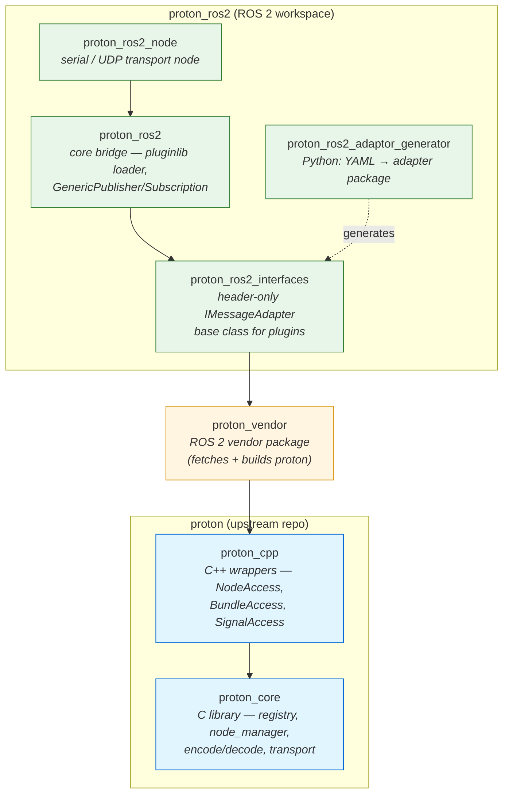

# proton_ros2

`proton_ros2` is a ROS 2 adaptor for proton. It runs both a ROS 2 node and a `proton_cpp` node in the same process, and bridges proton bundles to ROS 2 topics for publishers and subscribers.

proton_ros2 is a collection of packages for running proton on ROS 2 robots. These packages create an ecosystem to map proton bundles to ROS 2 messages and topics.

## Package Hierarchy



:::note
The `proton_ros2` package is only released for **ROS 2 Jazzy**, but can be built from source on other ROS 2 distros.
:::

## Message Bridging

In order to map the runtime-configurable proton Signals to compile-time ROS 2 messages, a binding configuration is required. This binding configuration maps proton's Signal types to specific ROS 2 message types. Bundles are analagous to publishers and subscribers, in that when a Bundle is successfully decoded, the [bundle callback](./proton_core.mdx#bundle-decode-callback) can be used to trigger a topic publication, and a received topic can trigger a Bundle to be sent to a peer.

### Type Mapping

Proton Signal types are simplistic enough to map to common ROS 2 message field types:

| ROS 2     | proton   |
| --------- | -------- |
| `float32` | `float`  |
| `float64` | `double` |
| `int8`    | `int32`  |
| `int16`   | `int32`  |
| `int32`   | `int32`  |
| `int64`   | `int64`  |
| `uint8`   | `uint32` |
| `uint16`  | `uint32` |
| `uint32`  | `uint32` |
| `uint64`  | `uint64` |
| `bool`    | `bool`   |
| `char`    | `uint32` |
| `byte`    | `uint32` |
| `string`  | `string` |
| `byte[]`  | `bytes`  |

:::note
Types outside of this table are not currently supported!!!
:::

### Message Binding Plugins

In order to 

## Message Binding Configuration

In the proton configuration file, a `ros2` section can be added to map proton Bundles to ROS 2 topics or services.

### Topics

Topic publishers or subscribers can be configured with the following keys:

| Key       | Type              | Description                      | Required |
| --------- | ----------------- | -------------------------------- | -------- |
| `topic`   | `string`          | Topic name                       | Yes      |
| `message` | `string`          | ROS 2 message type               | Yes      |
| `bundle`  | `string`          | The proton Bundle for this topic | Yes      |
| `qos`     | `string` or `Map` | The QoS profile for this topic   | No       |

Bundles that the target consumes will create a ROS 2 publisher, while Bundles that the target produces will create a ROS 2 subscriber. The Bundle must have a signal with a name matching the path of the ROS 2 message field, as well as the same equivalent type.

#### Example

To create a publisher to the topic `/my_string` of type `std_msgs/msg/String`, the following configuration can be used:

```yaml
nodes:
  - name: pc
    transport:
      type: udp4
      ip: 127.0.0.1
      port: 11416
  - name: mcu
    transport:
      type: udp4
      ip: 127.0.0.1
      port: 11417

connections:
  - first: {node: pc, id: 0}
    second: {node: mcu, id: 0}

bundles:
  - name: my_string
    id: 0x100
    producer: mcu
    consumer: pc
    signals:
      - {name: data, type: string, capacity: 64}

ros2:
  topics:
    - {topic: /my_string, message: std_msgs/msg/String, bundle: my_string}

```

When the node is launched with `pc` as the target, it will know that `pc` consumes the `my_string` bundle, and so it will create a publisher that will convert the bundle to a `std_msgs/msg/String` and publish the message as soon as the bundle is consumed.

Note that the signal is named `data` to match the equivalent ROS 2 [field](https://github.com/ros2/common_interfaces/blob/137e97dc5ec724b78cdbaa3b89927c3c29f81f02/std_msgs/msg/String.msg#L6).


### QoS

The QoS profiles for both Topics and Services can also be configured. You can either choose a predefined standard profile, or create a custom one. To choose a standard profile, set the value of the `qos` key to the name of the profile.

#### Standard profiles

The following standard QoS profiles are supported:

| Profile           | Description                           |
| ----------------- | ------------------------------------- |
| `default`         | Default topic profile                 |
| `services`        | Default services profile              |
| `sensor_data`     | Best Effort sensor data profile       |
| `rosout`          | Transient Local profile for `/rosout` |
| `system_defaults` | Default profile based on middleware   |

For example, a `/rosout` topic can be defined like this:

```yaml
ros2:
  topics:
    - {topic: /rosout, message: rcl_interfaces/msg/Log, qos: rosout, bundle: log}
```

#### Custom profiles

A custom QoS profile can be created by defining the value of the `qos` key as another map. The map can have the following keys:

| Key           | Type     | Required |
| ------------- | -------- | -------- |
| `history`     | `string` | No       |
| `depth`       | `uint32` | No       |
| `reliability` | `string` | No       |
| `durability`  | `string` | No       |

##### History

The history value can be one of the following policies:

| Policy           | Description                    |
| ---------------- | ------------------------------ |
| `keep_last`      | Keep the last `depth` messages |
| `keep_all`       | Keep all messages              |
| `system_default` | Default based on middleware    |

> The default history is `system_default`

##### Depth

If `history` is set to `keep_last`, `depth` will determine how many messages to keep.

> The default depth is `10`

##### Reliability

The reliability value can be one of the following policies:

| Policy           | Description                                                                |
| ---------------- | -------------------------------------------------------------------------- |
| `best_effort`    | Attempt to deliver samples, but may lose them if the network is not robust |
| `reliable`       | Guarantee that samples are delivered, may retry multiple times             |
| `system_default` | Default based on middleware                                                |

> The default reliability is `system_default`

##### Durability

The durability value can be one of the following policies:

| Policy            | Description                                                                               |
| ----------------- | ----------------------------------------------------------------------------------------- |
| `transient_local` | The publisher becomes responsible for persisting samples for “late-joining” subscriptions |
| `volatile`        | No attempt is made to persist samples                                                     |
| `system_default`  | Default based on middleware                                                               |

> The default durability is `system_default`


For example, a `my_string` topic can be defined like this:

```yaml
ros2:
  topics:
    - topic: my_string
      message: std_msgs/msg/String
      qos:
        history: keep_last
        depth: 15
        reliability: best_effort
        durability: volatile
      bundle: my_string
```

## Usage

The executable produced by **proton_ros2** is `proton_ros2_node`.

It takes two ROS parameters:

- `config_file` (string): path to the proton YAML configuration file
- `target` (string): proton node name this process represents (used to decide which bundles are produced/consumed)

The launch file `proton_ros2.launch.py` wires these parameters and supports an optional `namespace`.

Launch the node with `ros2` CLI:

```bash
ros2 launch proton_ros2 proton_ros2.launch.py config_file:=/path/to/config.yaml target:=target_node namespace:=/my_namespace
```

The launched node will automatically spin up a ROS 2 and proton node, connect to proton peers, and create ROS 2 publishers, subscribers, services, and clients as defined in the configuration file.

